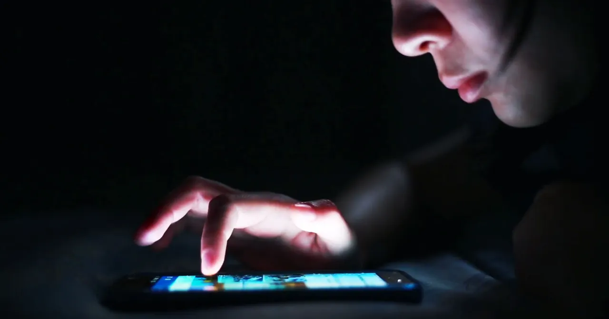
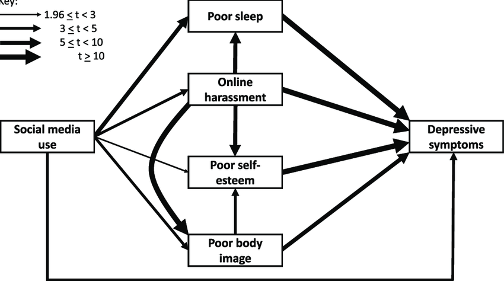

+++
title = "Die Nutzung sozialer Medien – ein Grund für psychische Erkrankungen?"
date = "2023-05-30"
draft = false
pinned = false
tags = ["Deutsch", "Reportage", "sozialeMedienalseinGrundfürpsychischeErkrankungen"]
description = ""
footnotes = "\\*Erklärung in der Infobox ‘Was sind «soziale Netzwerke» überhaupt?’"
+++
**Soziale Netzwerke werden immer beliebter. Sie ermöglichen Kontakt zwischen den Nutzer:innen über jede Entfernung hinweg. Doch mit dem Anstieg der User:innen, steigt auch die Kritik. Viele Studien und Psychiater weisen auf die Auswirkungen der sozialen Medien hin.**

Von **Manon Jenni** und **Amélie Roggo**

Der Bildschirm leuchtet hell auf. Eine App nach der anderen wird geöffnet. Scrollen, liken,  scrollen…Sophie (Name von Autoren geändert) beschäftigt sich wie auch viele andere Jugendliche täglich mit den sozialen Medien. Bis zu fünf Stunden pro Tag ist sie unter der Woche am Handy. Doch hinter dem ständigen Scrollen steckt noch viel mehr. 

> *»Social Media has become a space in which we form and build relationships, shape self-identity, express ourselves, and learn about the world around us; it is intrinsically linked to mental health«* 
>
> *\- Shirley Cramer CBE, Former Chief Executive, RSPH [Link zur Quelle](https://www.rsph.org.uk/our-work/campaigns/status-of-mind.html)*

Wir treffen Sophie, die sich dazu bereit erklärt hat, mit uns ein Interview zu führen. Sie leidet unter Symptomen einer Depression und vermutet, dass einer der Gründe dafür die sozialen Medien sein könnte, erklärt sie uns. Sie erzählt uns, dass sie merkt, wie sie ihre Zeit in den sozialen Medien nicht mehr unter Kontrolle hat, doch sich von den sozialen Medien zu entfernen ist für sie unvorstellbar.

Psychiatrische Erkrankungen sind seit dem Beginn der Nutzung der sozialen Medien erheblich häufiger geworden. Insbesondere die Diagnose der depressiven Symptome nimmt zu.  Wie Sophie leiden heutzutage viele Jugendliche unter Depressionen bzw. psychischen Erkrankungen. Die sozialen Medien werden verdächtigt, eine grosse Auswirkung darauf zu haben. Denn die virtuelle Welt wird oft auf vielen Ebenen mit der Realität verbunden.  Was im Netz passiert, hat Konsequenzen darauf, wie Menschen im echten Leben zum Beispiel hinsichtlich Emotionen und deren Verarbeitung umgehen.

``
**Definition:** 
Unter sozialen Medien versteht man alle digitalen Medien bzw. Plattformen, die Nutzern ermöglichen, sich im Internet zu vernetzen, so dass sie über virtuelle Gemeinschaften oder Netzwerken gegenseitig Kommunizieren und Informationen und Ideen interaktiv austauschen oder Teilen können. 
Dazu gehören beispielsweise Plattformen wie Tiktok, YouTube, Instagram, Twitter, Snapchat oder auch WhatsApp. 
**Nutzung:**
Man spricht von zwei unterschiedlichen Arten der Nutzung von sozialen Medien. Unter der passiven Nutzung versteht man, wenn man nur die Beiträge anderer liest oder anschaut. Aktive Nutzer:innen posten selber Inhalte, teilen oder kommentieren.
``

> «Mir fällt es schwer, das Smartphone am Abend auszuschalten.»

Ausserdem eng miteinander verbunden sind die psychische Gesundheit und der Schlaf. Abendliche und nächtliche Nutzung der sozialen Medien erschweren nachweislich die gesundheitlich wichtige Schlafenszeit, die der Körper zum Regenerieren braucht. Insbesondere bei Apps wie TikTok, ist der Feed einzigartig und mithilfe des Algorithmus auf die jeweiligen Interessen der Nutzer:innen zugeschnitten. Dabei werden Videos mit einer Dauer von durchschnittlich 30 Sekunden vorgeschlagen, so dass man ständig unterhalten bleibt und die Bildschirmzeit nicht mehr unter Kontrolle hat. Durch einen «swipe» nach oben gelangt man auf das nächste Kurzvideo. Die vorgeschlagenen TikTok’s enden nie, man kann also unendlich viele davon anschauen. Dadurch gestaltet sich das Einschlafen schwierig, viele können sich schlecht vom Smartphone lösen und dies führt zu einer verkürzten Schlafenszeit. 
Sophie selber habe deswegen Probleme und immer wieder Schwierigkeiten mit dem Einschlafen. «Mir fällt es schwer, das Smartphone am Abend auszuschalten. Oft gehe ich sehr spät schlafen und bin am folgenden Tag sehr müde und unkonzentriert. Manchmal schlafe ich auch mit dem Smartphone in der Hand ein und wache später in der Nacht wieder auf. »

### Vermeintliche Experten in den sozialen Medien:

Wenn man die sozialen Medien verantwortungsvoll nutzt, kann man dadurch auch einen Wissenszuwachs erzielen. Zum Beispiel, indem man sie als Zugang zu Gesundheitserfahrungen von anderen Menschen oder Gesundheitsinformationen von Expert:innen verwendet. Es kann riskant sein, wenn man sich bei einem Verdacht auf psychische Erkrankungen nur auf Internetseiten informiert oder sich ausschliesslich dort Hilfe holt. Es gibt oft Expert:innen, die sich online als solche ausgeben, obwohl sie gar keine sind, sagt die Neuropsychologe Johanna Klar. Wir führen mit ihr ein Interview, in dem sie uns erklärt, dass es wichtig sei, dass die online Therapeuten irgendwo zu einer Organisation dazugehören sollten und dass die wirklichen Experte:innen im echten Leben nicht online ersetzt werden können. 

### Die sozialen Medien aufgeklärt nutzen: 

Um von den sozialen Medien profitieren zu können, sollte man wissen, wie man sie am besten nutzt und wie sie im Hintergrund funktionieren.  «Ganz wichtig ist, dass man die Sachen, die man darauf sieht, sehr stark hinterfragt», erklärt Social Media-Managerin Céline Roggo. Johanna Klar sagt auch, dass es wichtig sei, Kinder und Jugendlichen einen guten Umgang mit sozialen Medien beizubringen, so dass sie wissen, welche Gefahren es gibt und Soziale Medien aufgeklärt nutzen. Dabei ist es auch sehr wichtig, dass man die sozialen Medien altersangemessen nutzt. Sophie erzählte uns in einem Interview, dass sie Instagram bereits mit 11 Jahren heruntergeladen habe, obwohl die Nutzung erst ab 13 Jahren erlaubt sei. Es gibt also auch jüngere User:innen, die bei der Anmeldung ein falsches Geburtsdatum angeben. Laut Viera Pirker, der Autorin des Artikels «Social Media und psychische Gesundheit» in ‘Communicatio Socialis’, einer Zeitschrift für Medienethik, wird die elterliche Verantwortung nicht umfassend genug wahrgenommen.  Die Eltern sollten das Thema mit ihren Kindern zusammen anschauen und erklären, statt nur zu warnen das soziale Medien schlecht seien und es ihnen zu verbieten. Ausserdem wäre es auch gut den Umgang mit den sozialen Medien in der Schule zu behandeln. 

Im Lehrplan 21 sind die überfachlichen Kompetenzen eigentlich eingearbeitet. Die Lehrkräfte stärken die Schüler:innen in ihren Lebenskompetenzen. Mit der Vermittlung von Medienkunde soll eine fachliche Grundlage gelegt werden. Dafür gibt es z.B. «Freelance», ein Lehrmittel für Jugendliche. Die Schüler:innen sollen damit lernen das eigene Nutzungsverhalten zu reflektieren. Dabei geht es um verschiedene Themen, die mit den sozialen Medien verknüpft sind, wie zum Beispiel Selbstdarstellung oder die eigene Befindlichkeit im Netz. Die Schüler:innen sollen dazu angeregt werden, das Verhalten im Netz zu reflektieren und gegebenenfalls anzupassen.\
Wir selbst haben das Thema leider nie in der Schule behandelt, obwohl es eigentlich im Lehrplan integriert sein sollte. Viele Lehrer:innen erkennen die Wichtigkeit dieses Themas nicht. Da in den allermeisten Schulen heutzutage mobile Geräte zur Verfügung gestellt werden oder die Schüler:innen selbst ihr mobiles Gerät mitbringen (BYOD), treten viele Kinder in Kontakt mit sozialen Medien, unabhängig davon, ob sie privat beispielsweise ein Smartphone besitzen oder nicht. Da wäre es sinnvoll die Schüler*:*innen aufzuklären oder zum Beispiel eine Unterrichtslektion über dieses Thema zu gestalten. 

Eine psychische Erkrankung bei der Nutzung sozialer Medien tritt jedoch nicht aus dem Nichts aus. Symptome oder Hinweise auf Erkrankungen wie zum Beispiel Depressionen treten häufig auf. Um sicher zu sein, ob es eine ernste Erkrankung ist, sollte man es von einem Psychiater abklären lassen, da sie vertiefte Kenntnisse (Entstehung, Verlauf usw.) über psychische Erkrankungen haben. Des Weiteren ist das Nutzen der sozialen Medien kein Hauptgrund für die Entstehung psychischer Erkrankungen, weil meistens auch weitere Faktoren aus dem Umfeld eine Rolle spielen. Frau Klar fasst zusammen: «Es führt nicht zu einem neuen Problem, sondern verstärkt Sachen, die einem vorher schon belastet haben. Es ist also ein Verstärker.» Somit ist es umso gefährlicher soziale Medien bei einer schon vorhandenen Erkrankung wie beispielsweise social anxiety zu benutzen, da diese dadurch erhöht werden könnten. Gesicherte Zusammenhänge zwischen den sozialen Medien und den psychischen Erkrankungen sind jedoch nicht einfach herzustellen. Die Grafik oben; Bild 2.  zeigt diese Zusammenhänge sehr gut. Es wurde Inzwischen aber bewiesen, dass aktiveNutzung der sozialen Medien das Wohlbefinden steigern  (da sie das Gefühl der Einbindung unterstützt und soziale Interaktionen erhöht), während passive Nutzung eher soziale Vergleiche und Neid hervorruft und negative Affekte auf das subjektive Wohlbefinden nach sich zieht.  Plattformen wie WhatsApp werden meistens aktiv gebraucht, doch andere Plattformen wie Tiktok und YouTube werden fast ausschliesslich passiv genutzt , was sie dadurch anfälliger für negative Einflüsse auf das Wohlbefinden machen. Es lassen sich also positive und negative Einflüsse der Social Media-Nutzung beobachten. 
Negative Aspekte zum Beispiel ein geringes Selbstwertgefühl, das durch den ständigen Vergleich mit idealen Körperbildern entsteht, Cyberbullying, FoMO: Die Angst etwas zu verpassen, unregelmässiger Schlaf, Aufmerksamkeitsstörungen, Symptome von Angststörungen und Depressionen, werden von der RSPH als «gefährlich» für das psychische Wohlbefinden eingestuft und tauchen besonders auf wenn man die sozialen Medien zu viel braucht.
Positive Einflüsse wie; Beziehungen herstellen, pflegen und ausbauen, Emotionale Unterstützung, sich verstanden fühlen, Gemeinschaftsbildung (wie z.b die LGBTQ+-Community online «safe spaces» bietet), aber auch Zugang zu Gesundheitsexpertinnen, sind sehr wichtig und hilfreich für viele Jugendliche.

Zu Schluss möchten wir nochmals erinnern dass man die sozialen Medien aufgeklärt und informiert nutzen sollte. Sophie versucht jetzt ihre Bildschirmzeit auf den sozialen Medien zu limitieren und überlegt sich genauer, welchen Personen sie auf den Sozialen Medien Folgt und ob dies sinnvoll ist. «Ich versuche mir einen bestimmten Tag in der Woche fest zu legen, an dem ich keine sozialen Medien benutze » meinte sie. «Wenn ich das schaffe fühle ich mich meistens viel besser».